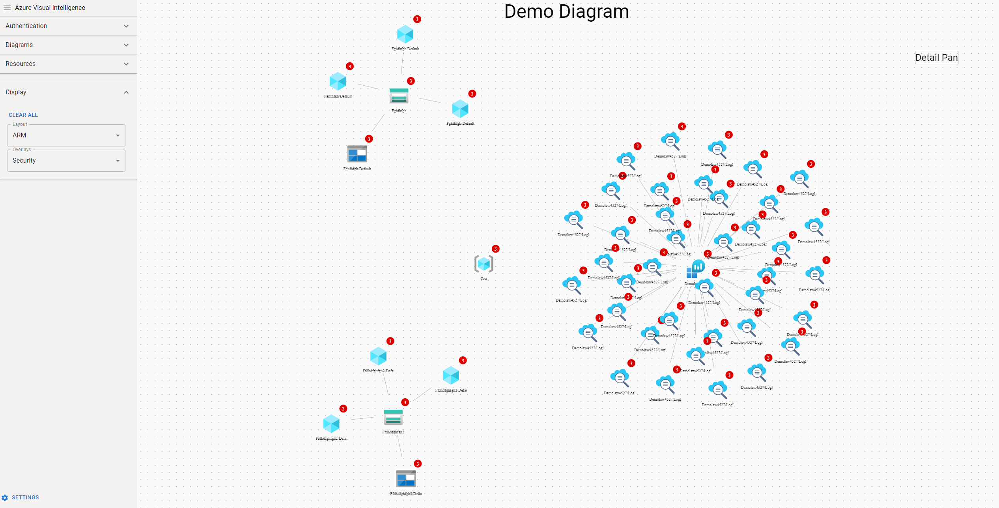

# Azure Visual Intelligence

## Inspiration

Be honest, every time you want to explain a new architecture to your customer, you pick a pen and you start drawing.

Moving on to the implementation phase : you need to learn ARM template, Biceps, Terraform, or doing it manually in the Portal with consistency, good luck, see you in 6 months minimum.

You have finished your implementation ? Are you compliant with the recommendations Microsoft provides through Advisor ? Security Center ? default policies ? You were not aware all of those tools existed ? your lost.

What if you could use your concept diagram to implement , apply best practices, monitor, and well, everything else ?

## Description

Every architecture starts with a diagram.

But then we are quickly submerged by Azure complexity : template language and tool diversity.

This project intends to put back diagram as the core representation of everything you will achieve in Azure

## Usage

This is still a verly early project so to use this you need to download it and compile it yourself

Pull sources from Git

Edit config (you need to provide your tenant ID and your app ID)

npm run start

## Contribute

Early stages.

Reach out to chboudry@microsoft.com

We welcome every enthusiasts.
