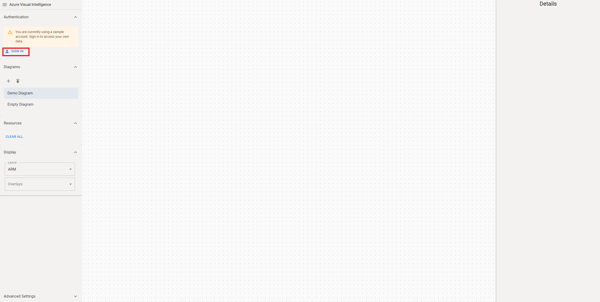
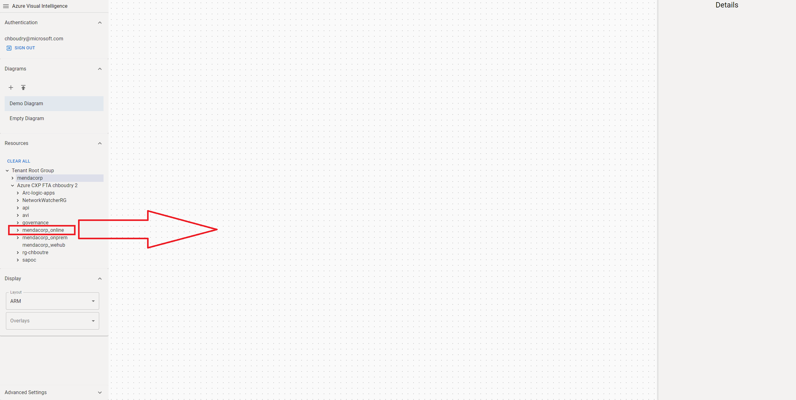
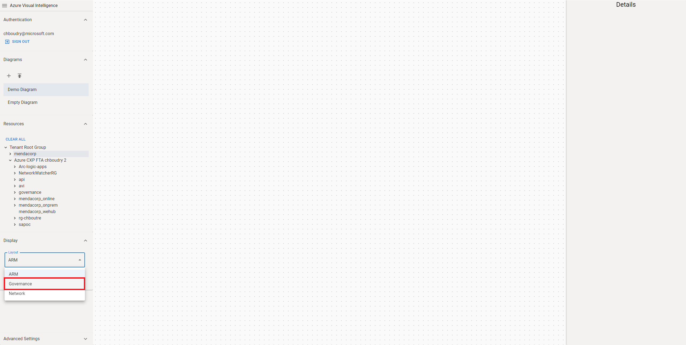

## 1. Sign in

     
Log in to configured 

## 2. DragnDrop resources

1. UI diagram/Graph.js dispatch DRAGnDROP
1. on DRAGnDROP event -> handleDragnDrop 
    1. Get : (getDiagramResources)
    1. addResourceToDiagram
        1. Update payload resources from toolbox to resource of AVIresource type
        1. armEngine.GetResourcesAndRelatedResources
        1. return [resources, relations]
    1. Set : (setDiagramResources setDiagramRelations)
1. on setDiagramRelations event -> handleNewDiagramResources
    1. Get : (getDiagramResources getAzureSettings getDiagramRelations) 
    1. all layout (AddDiagramResourceToDisplay)
    1. Set : (all (setDiagramNodes))
1. UI Graph useEffect
    1. graph.current.elements().remove()
    1. graph.current.add(diagramDisplay[currentLayout].elements)
    1. layout.current = graph.current.makeLayout({configgraph})
    1. layout.current.run()

## 3. Switching layout

